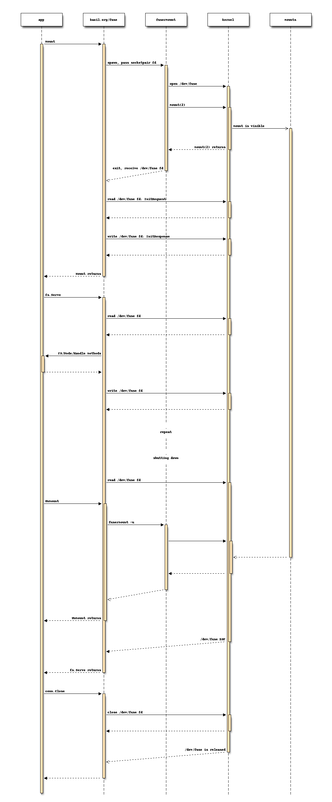
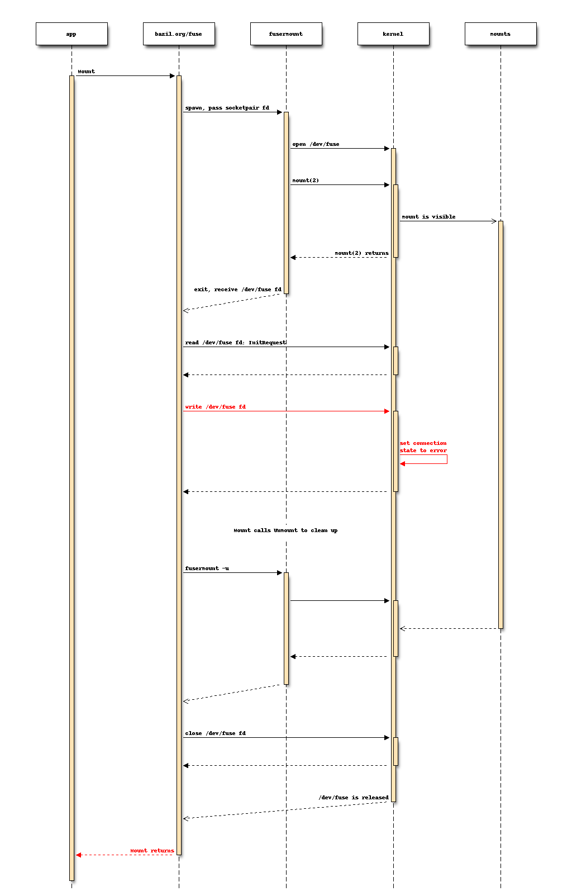

# The mount sequence

FUSE mounting is a little bit tricky. There's a userspace helper tool
that performs the handshake with the kernel, and then steps out of the
way. This helper behaves differently on different platforms, forcing a
more complex API on us.

## Successful runs

The mount is immediate and file system accesses wait until the requests are served.

## Errors

Let's see what happens if `initRequest` gets an error response.
The mountpoint is temporarily there but all operations will fail:

